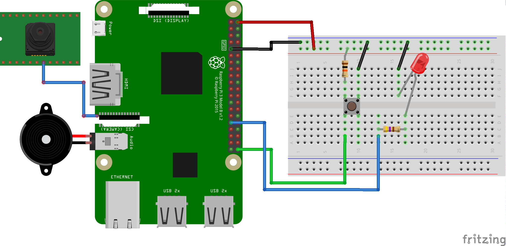

# Android Things TensorFlow image classifier sample

This sample demonstrates how to run TensorFlow inference on Android Things.

When a GPIO button is pushed, the current image is captured from an attached
camera. The captured image is then converted and piped into a TensorFlow model
that identifies what is in the image. Up to three labels returned by the
TensorFlow network is shown on logcat and on the screen, if there is an
attached display. Also, the result is spoken out loud using text-to-speech and
sent to an attached speaker, if any.

This project is based on the [TensorFlow Android Camera Demo TF_Classify app](https://github.com/tensorflow/tensorflow/blob/master/tensorflow/examples/android/).
The TensorFlow training was done using Google inception model and the trained data set
is used to run inference and generate classification labels via TensorFlow Android Inference
APIs.

This sample uses the [TensorFlow inference library](https://bintray.com/google/tensorflow/tensorflow-android) and does not require any native build tools. You can add the TensorFlow inference library to your project by adding a dependency in your build.gradle, for example:
```
dependencies {
    compile 'org.tensorflow:tensorflow-android:1.2.0'
}
```

Note: this sample requires a camera. Find an appropriate board in the [documentation](https://developer.android.com/things/hardware/developer-kits.html).

## Pre-requisites

- Android Things compatible board e.g. Raspberry Pi 3
- Android Things compatible camera e.g. Raspberry Pi 3 camera module
- Android Studio 2.2+
- The following individual components:
    - 1 push button
    - 2 resistors
    - 1 LED light
    - 1 breadboard
    - jumper wires
    - Optional: speaker or earphone set
    - Optional: HDMI display or Raspberry Pi display

## Schematics



## Build and Install

On Android Studio, click on the "Run" button.
If you prefer to run on the command line, type
```bash
./gradlew installDebug
adb shell am start
com.example.androidthings.imageclassifier/.ImageClassifierActivity
```

If you have everything set up correctly:

0. Wait until the LED turns on
0. Point the camera to something like a dog, cat or a furniture
0. Push the button to take a picture
0. The LED should go off while running. In a Raspberry Pi 3, it takes less
   than one second to capture the picture and run it through TensorFlow, and
   some extra time to speak the results through Text-To-Speech
0. Inference results will show in logcat and, if there is a display connected,
   both the image and the results will be shown
0. If there is a speaker or earphones connected, the results will be spoken via
   text to speech

## License

Copyright 2017 The Android Things Samples Authors.

Licensed under the Apache License, Version 2.0 (the "License");
you may not use this file except in compliance with the License.
You may obtain a copy of the License at

  http://www.apache.org/licenses/LICENSE-2.0

Unless required by applicable law or agreed to in writing, software
distributed under the License is distributed on an "AS IS" BASIS, WITHOUT
WARRANTIES OR CONDITIONS OF ANY KIND, either express or implied.  See the
License for the specific language governing permissions and limitations under
the License.
# water_alarm_android_things
